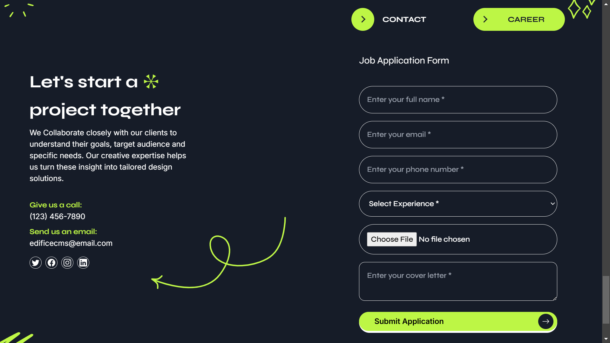

# Project Documentation

## Overview
This project implements a modern digital marketing agency website with integrated React components for enhanced user interaction. The website features a responsive design, dynamic form handling, and seamless state management.

## Technical Stack
- HTML5
- React 18
- Tailwind CSS
- Babel (for JSX transformation)
- Local Storage (for data persistence)

## Architecture

### React Component Integration
The project uniquely integrates React components within a traditional HTML structure:
- Components are mounted to specific root elements in the HTML
- Babel handles JSX transformation in the browser
- React components maintain their own state while coexisting with static HTML content

### Key Components
1. **JobApplication.js**
   - Handles job application form submissions
   - Implements form validation
   - Manages file uploads
   - Stores applications in localStorage

2. **ApplicationsTable.js**
   - Displays submitted applications
   - Provides CRUD operations
   - Implements pagination

## UI Enhancements

### Contact Section
- Dual-purpose form section with toggle functionality
- Switches between Contact and Career forms
- Maintains consistent styling with the theme

### Styling
- Primary color: #161c28 (Dark blue)
- Accent color: #BDF645 (Neon green)
- Consistent rounded corners and hover effects
- Custom focus states with accent color rings

## Form Implementation

### Validation
- Real-time input validation
- Custom error messages
- File type restrictions for resume uploads
- Required field handling

### State Management
- React useState for form data
- useEffect for data fetching
- Local storage integration for persistence
- Error state handling

## Data Flow
1. User inputs data in forms
2. Client-side validation occurs
3. Data is processed and stored locally
4. Table component auto-refreshes to show updates
5. CRUD operations update both UI and storage

## Responsive Design
- Mobile-first approach
- Tailwind breakpoints for different screen sizes
- Flexible grid layouts
- Adaptive navigation menu

## Screenshots
Referance for Job Appliaction section is integration

## Performance Considerations
- Optimized component re-rendering
- Efficient state updates
- Lazy loading for table data
- Debounced search functionality

This documentation provides an overview of the development process and implementation details. The project successfully combines modern React features with traditional web technologies while maintaining a cohesive and responsive user interface.